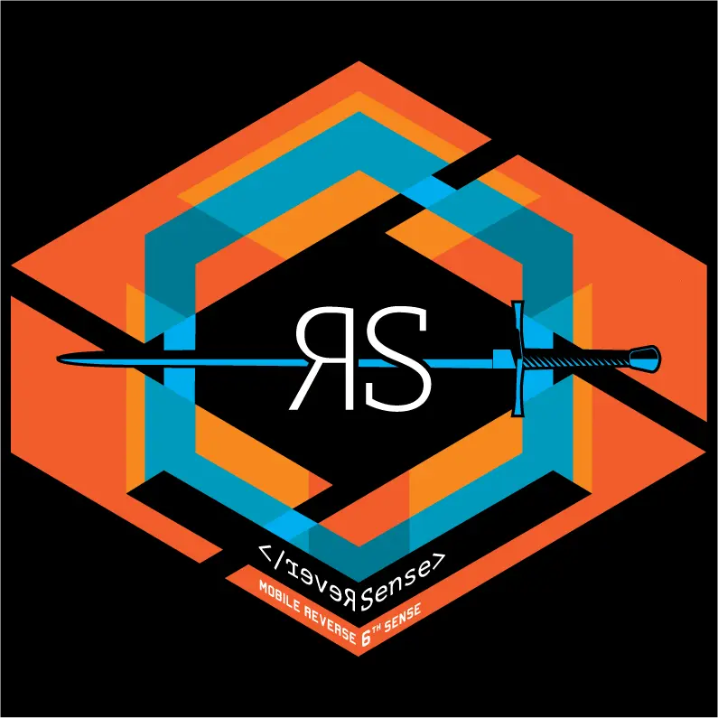
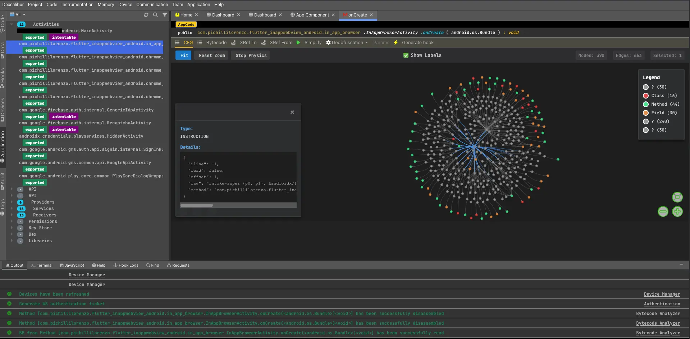

<a href="https://reversenseorg.github.io/rs-doc/"></a>

#    Reversense (also known as Dexcalibur 2)

--------


[](https://discord.gg/Pfw7Kc3dS)


Current git `master` branch is `2.0.0`


## Description


Reversense (Dexcalibur2) is a fully rewriting and rethinking of Dexcalibur.
It is a new project which aims to provide a better user experience, and a better coverage, suitable for intelligence and offensive security.

Reversense is a binary intelligence platform that automates the reverse
engineering of mobile and embedded applications. It analyzes applications in
their real execution context and supports a wide range of target
languages, architectures, and operating systems.

Instead of scattering work across disconnected tools, Reversense aggregates
static analysis, dynamic instrumentation, emulation, and scanning into a
single universal representation of the target — and lets teams explore it
together.


<a href="https://reversenseorg.github.io/rs-doc/"></a>


Do you want share something or do you need some help ? Join our official chats :


[](https://discord.gg/Pfw7Kc3dS) : the prefered way to give a response

[Telegram](https://t.me/dexcalibur) - Alternative for whose are not familiar with Discord


For Professional use, support & modules : [www.reversense.com](https://www.reversense.com)


## Table of contents

- [Why Reversense](#why-reversense)
- [Highlights](#highlights)
- [How it works](#how-it-works)
- [Features](#features)
- [Interoperability](#interoperability)
- [Use cases](#use-cases)
- [Getting started](#getting-started)
- [Documentation](#documentation)
- [Contributing](#contributing)
- [Services](#services)
- [About](#about)
- [License](#license)
## Why Reversense

Mobile and embedded applications are everywhere, yet their internal behavior
stays opaque: what data they process, whether they are vulnerable or
malicious, and how they defend themselves. Traditional approaches run into
recurring walls:

- Obfuscated binaries that resist static reading.
- Behavior that depends on a specific device model or execution context.
- Secure channels, white-box crypto, and proprietary protocols that defeat
  ordinary network interception.
- Vulnerable third-party dependencies that stay invisible without an SBOM.
- A manual reverse-engineering process that is slow, costly, and hard to staff.
  Reversense addresses these by modeling the **whole** application and its
  environment, then automatically instrumenting and executing it to observe what
  really happens.

## Highlights

- **Collaborative by design** — several analysts work on the same project and
  binary codebase at once, each running the target on their own terminal,
  without conflicts.
- **Automated scanning** — one-click SAST / DAST / IAST batteries driven by a
  customizable assurance model, producing shareable reports.
- **LLM-ready** — every feature is invokable by an AI through a built-in MCP
  server, with the same access control as the standard API.
- **Device-farm compatible** — allocate and drive physical or virtual
  terminals, locally or in a farm.
## How it works

Reversense operates in four phases:

1. **Discovery** — discovers the execution environment (permissions, hardware
   capabilities, CPU, TEE, …), retrieves the target application or firmware,
   and provisions a virtual test bench.
2. **Modeling** — models the entire application and environment into the
   Reversense *universal representation*, which is updated automatically as
   tools and bots discover new data.
3. **Instrumentation** — identifies points of interest (POIs), automatically
   generates probes to trace flows and mechanisms, then refines and tags the
   collected traces back into the model.
4. **Execution, exploration & test** — runs the application to generate traces,
   then enriches the model and deductions. Stateful instrumentation lets the
   platform adapt to protections observed in previous runs.


## Features

### Discovery & test bench
Manual or batch target selection (or directly from a device), authenticated
download from a store/server/terminal, allocation of one or more devices, and
automatic or manual configuration of the target OS to match fine hardware
contexts (TV, watches, IoT). Project access control by user, team, or
organization.

### Universal modeling
Exhaustive data extraction from all files and archives; a universal
abstraction that brings machine code, binaries, graphical components, scripts,
dumps, network traces, and system calls into one place. Combined static
analysis, partial emulation, and symbolic execution. Native **Radare2**
integration and a **Merlin** search engine to explore the representation and
find code by its execution behavior.

### Instrumentation & dynamic analysis
Automatic generation of hooks (Java methods, Objective-C, native functions,
instructions, interrupts, instances) in a few clicks. A **KeyPoints**
scheduler marks moments in the app lifecycle to load/unload hooks and trigger
actions (memory dumps, screen recording, custom scenarios). Multi-thread and
inter-process observation, multi-terminal scenarios for protocol analysis,
device-fingerprint control, and a fuzzing engine. Dynamic cross-references are
built automatically during execution.

### Scan & exploration
One-click SAST / DAST / IAST / SCA batteries, organized by theme against an
editable **assurance model**. Scanners behave like a real user, building a test
plan and producing explorable results plus artifacts (screenshots, input and
traffic recordings). Coverage includes permissions, SELinux policy, OWASP
MASTG, SBOM, and detection of 90+ types of personal data across multiple
states.

### Deobfuscation
Automatic on-the-fly decompilation with static analysis and AST update for
dynamically loaded code. Ready-to-use bypass tactics for common RASP
(anti-hook, anti-root, anti-emulator, …). Code synthesis via concrete and
symbolic execution to generate simplified representations or find bypass
options.

### Analysis tooling
- **Stereoscopic analysis** — a search engine over traces and ASTs spanning
  100+ node types (UI components, file content, hooks, …) with adjacency
  search, taint analysis, and distance; plus a tag system (400+ tags by
  default) to sort, search, and trigger actions.
- **Topological analysis** — system-API projection, application-topology
  visualization, and automatic UI-component inventory.
- **Binary analysis** — explore all target libraries, unit-emulate with
  **Unicorn**, spoof inputs/outputs/CPU context, fuzz, explore ASTs, and
  contextually spin up an emulator from any point of execution.
### Collaboration
One project, many terminals, many analysts, without conflicts. Markers, tags,
and Merlin queries can be kept private or shared with the team. Traces and the
hook configuration that produced them can be pooled and visualized across
users.

### Device manager
A single interface to allocate and manage physical or virtual terminals,
locally or in a farm. Virtual patching of terminal properties (Reversense
generates the required low-level hooks). Access controls and quotas so
terminals can be reserved for teams or projects.

### Extensibility
- **Inspectors** — plugins that extend analysis: define instrumentation
  strategies, chain them into analysis pipelines, and use inter-execution
  variables for stateful scenarios.
- **Actions** — attach actions to application states (download a file, dump
  process/region memory, trigger a host action) and record screen, network, or
  Bluetooth.
- **AssuranceModels** — scan binaries versus a set of SAST/DAST/IAST rules redacted inside an assurance model.
## Interoperability

- **Web Services API** — every feature and piece of information is reachable
  through a standardized API, documented in **OpenAPI** format.
- **Authentication** — two modules (API key and SSO) for production use.
- **MCP server** — exposes all features to an AI, enforcing the same access
  control as the standard API.
- **Model-Context Protocol API** — a dedicated API to enrich your own MCP
  server with Reversense capabilities.
## Use cases

Vulnerability research · threat intelligence · personal-data-flow analysis ·
deobfuscation and malicious-behavior detection · trojanization · security-
function bypass · re-engineering and feature extraction · firmware reverse
engineering · cryptographic-asset inventory and SBOMs · API identification ·
integration with an AI-driven system.

## Getting started

Start the server and visit the home page
```bash

```

### Prerequisites

- _List runtime/OS requirements (e.g. Linux, Docker, device access, …)_
### Installation

```bash
# TODO: replace with the real installation steps
git clone https://github.com/YOUR_USER/reversense.git
cd reversense
# ...
```

### Quick start

```bash
# TODO: minimal end-to-end example (load a target, run a scan, open results)
```

## Documentation

Full documentation: **[https://reversenseorg.github.io/rs-doc/](https://reversenseorg.github.io/rs-doc/)**

Show Dexcalibur 0.7 (old) demo video : [Demo: Less than 1 minute to hook 61 methods ? Not a problem. \(youtube\)](https://www.youtube.com/watch?v=2dGoolvMEpI)

## Contributing

Contributions are welcome. Please read [CONTRIBUTING.md](CONTRIBUTING.md)
before opening an issue or a pull request.


## Services

Reversense company is not a consulting firm, but professional services are available to
tailor the platform to your needs: training on the platform and on reverse
engineering, complete SBOM extraction, cryptographic-function inventory (CBOM),
fuzzing consulting, application network-flow mapping, deobfuscation and
protection-bypass support, custom scan repositories, and preparation of
specific environments (e.g. Tizen).


## About

Reversense is a French company founded in 2020 and based in Toulouse,
specializing in offensive cybersecurity, application security, and AI. Its
mission is to give security professionals the tools to automatically audit the
most complex applications as needs evolve.


## Get started

Prior to the first run, please create `$HOME/.dexcalibur/` folder where global settings will be stored

Frida Version : 16.1.4


- KeyCloak config
- SSO Config
- Init User DB

```
NODE_ENV=production DXC_SCHEMA=http DXC_HOSTNAME="127.0.0.1:8080" node ./dist/dexcalibur.js --gui=home,pro --dry
```

### 1.x Local administrator account

When Dexcalibur is installed, it generates an administrator account with random username and password.

This account is stored locally, into $HOME/.dexcalibur folder until the database is fully configured, then the local admin account is stored into DB.

This user account is tagged "local" instead of "federated", and can be disabled later by server administrator or restricted to be accessed only over a specific IP address.


## 2. Authentication Settings

### 2.A OpenID Connect


Copy following code into `$HOME/.dexcalibur`
```
{
    "discoverUri":"http://127.0.0.1:8080/realms/dxc-stagging",
    "client_id":"dxcengine_api",
    "client_secret":"<REDACTED>>",
    "redirectUris":[
        "http://127.0.0.1:8080/api-auth/cb"
    ],
    "postLogoutRedirectUris":[
        "http://127.0.0.1:8080/api-logout"
     ],
    
    "responseType":["code"]
}
```

## 3. Unit test

Some tests require environment variable to work properly. Find it below :

| Name             | Type   | Description                  | Example |
|------------------|--------|------------------------------|--------|
| DXC_MONGO_URL    | string | MongoDB uri                  |        |
| DXC_MONGO_PORT   | number | MongoDB listening port       |        |
| DXC_BINWALK_PATH | path   | Local path of binwalk binary |  `/opt/homebrew/bin/binwalk `      |

Some unit tests are skipped if such vars are not defined :

| Name | Test                    |
|------|-------------------------|
| DXC_BINWALK_PATH | `BinwalkRunner.test.ts` |

Run test :

```
npm run test
```


# 5. Troubleshoot

## 5.1 Add local admin created at install to existing projects in DB

```
db.getCollection('project').updateMany({ '_attr.owner': { $regex: /^16/ }},{ $set: { _attr: { owner: { _n: 'owner', _v: [ '0:fd49eb00-ff8b-4a67-a437-75dd3f2f7517' ] }, tester: { _n: 'tester', _v: [ '0:fd49eb00-ff8b-4a67-a437-75dd3f2f7517' ] }} }})
```
```
db.getCollection('project')
    .updateMany({ 
        '_attr.owner': { $regex: /^16/ }
    },{ 
        $set: { 
            _attr: { 
                owner: { _n: 'owner', _v: [ 'USER_UUID' ] }, 
                tester: { _n: 'tester', _v: [ 'USER_UUID' ] }
            } 
        }
    });
```

```
db.getCollection('project').updateMany({'_attr.owner': { $regex: /^16/ }},{ $set: {_attr: {owner: { _n: 'owner', _v: [ '0:380110fd-5dd4-468c-a1e5-9c5b38bc14bc' ] },tester: { _n: 'tester', _v: [ '0:380110fd-5dd4-468c-a1e5-9c5b38bc14bc' ] }}}});
```


### Parameters :

| ENV                  | Description                                                                              | Required | Format  |
|----------------------|------------------------------------------------------------------------------------------|----------|---------|
| DXC_VDM_HOST         | Uri of remote VDM                                                                        |          | uri     |
| DXC_VDM_PORT         | Port for remote VDM                                                                      |          | string  |
| DXC_NODE_RKNAME      | Name of the property holding the registration key                                        |          | string  |
| DXC_NODE_REG_KEY     | Path of the file containing the hash of the registration key                             |          | string  |
| DXC_NODE_REG         | Name of the property holding the registration key                                        |          | boolean |
| DXC_NODE_HEAP_SZ     | Max memory allowed for heap of slave nodes                                               |          | number  |
| DXC_HOSTNAME         | Public hostname where the service canbe reach (URL)                                      |          | uri     |
| DXC_MASTER_URI       | URI of master node                                                                       |          | uri     |
| DXC_MASTER_SSL       | Enforce SSL between slave nodes and master nodes                                         |          | boolean |
| DXC_PRIV_IP          | IP address or name of the node                                                           |          | uri     |
| DXP_SLAVE_HTTP_PORT  | Static HTTP port for slave node                                                          |          | number  |
| DXP_SLAVE_HTTPS_PORT | Static WS port for slave node                                                            |          | number  |
| DXP_HC_TIMEOUT       | Response timeout (ms) for HealthCheck requests from master to slaves. Default : 100000   |          | number  |_


# 8. Development setup

You must configure a global environment variable `DXC_DEV_WS` pointing to the development workspace directory, in your bashrc file.

With something like:
```
export DXC_DEV_WS=$HOME/dxc
```

Then makefile and others script will use this variable.


    /*
    networkActivity:NetworkTransaction[] = [
        {   server:{ ip:"216.34.12.98", countryCode:'US'},
            type:'req',
            protocol:'http',
            method:'GET',
            url:'https://firebase-settings.crashlytics.com/spi/v2/platforms/android/gmp/1:907869380789:android:305455082b687916/settings',
            body:{ size:0 },
            time:now-200000,
            source:SOURCES.SMITM
            },
        { server:{ ip:"216.34.12.98", countryCode:'US'},
            type:'req',
            protocol:'https',
            method:'POST',
            url:'https://crashlyticsreports-pa.googleapis.com/v1/firelog/legacy/batchlog',

            body:{ size:0 }, time:now-200500, source:SOURCES.SMITM },
        { type:'rep',
            protocol:'http',
            method:'GET',
            url:'',
            body:{ format:'json', data:JSON.stringify({rooted:true}), size: 17 }, time:now-200520, source:SOURCES.SMITM },
        { server:{ ip:"132.1.4.15", countryCode:'ES'}, type:'req', protocol:'https', method:'GET', url:'',  body:{ size:0 }, time:now-200600, source:SOURCES.IAST },
    ];*/


## Community

* Website: [https://reversenseorg.github.io/rs-doc/](https://reversenseorg.github.io/rs-doc/)
* Company: [https://www.reversense.com](https://www.reversense.com)
* Discord: [Server](https://discord.gg/Pfw7Kc3dS)
* Telegram: [Channel](https://t.me/dexcalibur)
* Twitter: [Profile](https://twitter.com/FrenchYeti)
* Home: [Github](https://github.com/reversenseorg)

## Sponsors


|  |
| --- |
| They offered a license for All Products <3 |

## Resources

There is actually few documentation and training resources about Dexcalibur. If you successfully used Dexcalibur to win CTF challenge or to find vulnerability, i highly encourage you to share your experience.

* [THCon 2020](https://www.youtube.com/watch?v=VRVV23glm_o)
* [SSTIC 2020](https://www.sstic.org/2020/presentation/dexcalibur_hook_it_yourself/)
* [Slides of Pass the SALT 2019 (PDF)](https://2019.pass-the-salt.org/files/slides/02-Dexcalibur.pdf)
* [Youtube : demonstration](https://www.youtube.com/watch?v=2dGoolvMEpI)
* [CLI User Guide](https://github.com/FrenchYeti/dexcalibur/wiki/CLI-User-guide)
* [User Guide](https://github.com/FrenchYeti/dexcalibur/wiki/User-guide)
* [Troubleshoots](https://github.com/FrenchYeti/dexcalibur/wiki/Troubleshoots)
* [Screenshots](https://github.com/FrenchYeti/dexcalibur/wiki)


## They wrote something about Dexcalibur

* [Awesome Frida](https://github.com/dweinstein/awesome-frida)
* [Awesome OpenSource Security](https://github.com/CaledoniaProject/awesome-opensource-security)
* [n0secure.org - PassTheSalt2019 J2](https://www.n0secure.org/2019/06/sstic-2019-j2.html)
* [rootshell.be - PassTheSalt2019 Wrap Up](https://blog.rootshell.be/2019/07/04/pass-the-salt-2019-wrap-up/)
* [PentesterLand - the 5 hacking newsletter 61](https://pentester.land/newsletter/2019/07/09/the-5-hacking-newsletter-61.html)
* [Technology Knowledge Database](https://github.com/ikey4u/tkb/blob/d26f47bf75d8d4c1aa5a655ab6c60f876ad7d402/tkb201907.txt)
* [Xuanwu Lab Security](https://github.com/MyKings/security-study-tutorial/blob/3a5661fb54c6320f403eefa95bcf787324a6e923/origin/Xuanwu%20Lab%20Security/2019/08/01.md)
* [Mobile Gitbook](https://github.com/z3f1r/mobile-gitbook)
* [274 - AppsSec Ezine](https://github.com/Simpsonpt/AppSecEzine/blob/60c530b32984921daa47164591e94bb564b0c75c/Ezines/274%20-%20AppSec%20Ezine)
* [ysh329 / Android Reverse Engineering](https://github.com/ysh329/android-reverse-engineering)


## Notes

Blog post :
[https://swarm.ptsecurity.com/fork-bomb-for-flutter/](https://swarm.ptsecurity.com/fork-bomb-for-flutter/)